
<h1 align="center">基于vue框架技术的漫画网站系统+vue</h1>

## 简介
漫画网站系统：角色分为管理员和用户；支持用户注册登录、个人中心管理、漫画分类浏览及收藏；管理员功能包含用户、漫画信息及分类管理和漫画资讯更新等。    --计算机毕业设计源码；毕设源码；java毕业设计源码

## 联系方式

<h3 align="center">获取完整代码与数据库文件 + 微信：deepguan QQ: 86050149 QQ群: 783742310</h3>

<h3 align="center">可帮忙远程部署 包运行成功！提供远程部署、修改代码、设计文档指导、代码讲解等服务！</h3>

## 功能介绍（完整见运行截图）
管理员： 基本功能包括登录、退出和后台管理权限。导航菜单提供漫画管理、用户管理、分类管理（如漫画分类和地区分类）、留言管理及系统管理功能。管理员可通过搜索栏快速定位内容，新增、修改或删除漫画信息及分类，编辑漫画编号、名称、分类、地区、作者等详情，并上传封面图片及设置连载状态。支持管理留言反馈与评论，查看和调整用户信息，保障系统的高效运行。

用户： 基本功能包括注册、登录、个人信息查看与修改。主页展示漫画资讯与推荐，支持通过导航菜单访问漫画信息、分类、地区及作者搜索功能，浏览详细的漫画内容与评论，进行点赞或收藏操作。用户可通过留言反馈模块提交意见，与系统互动。个人中心模块支持管理个人信息、查看收藏的漫画及浏览记录，提升漫画阅读体验与用户参与度。

## 运行截图
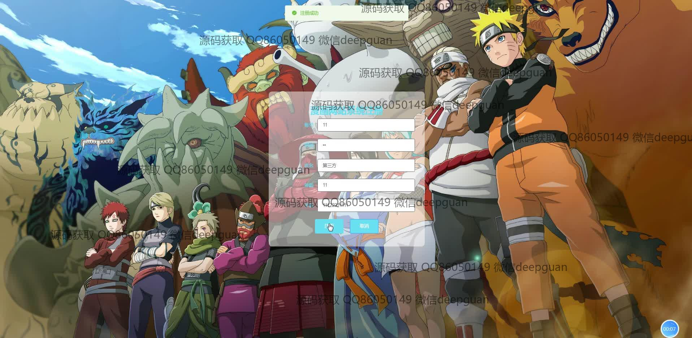
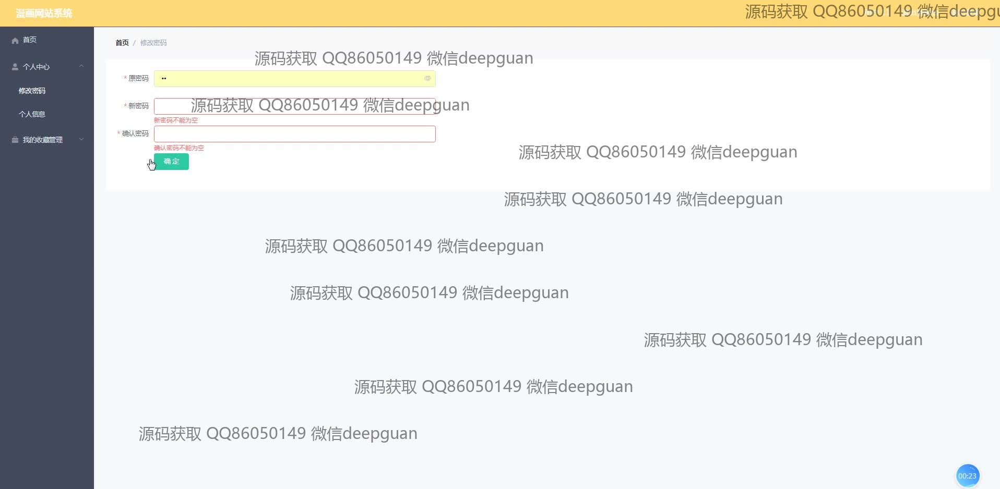
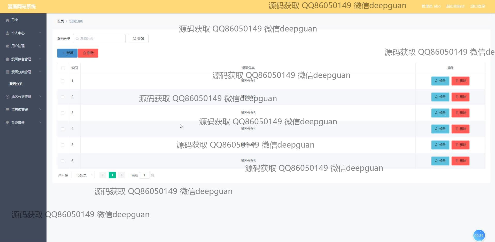
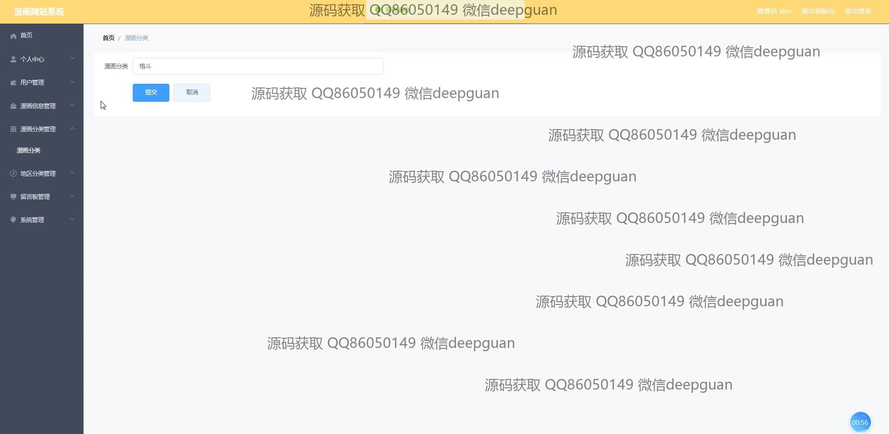
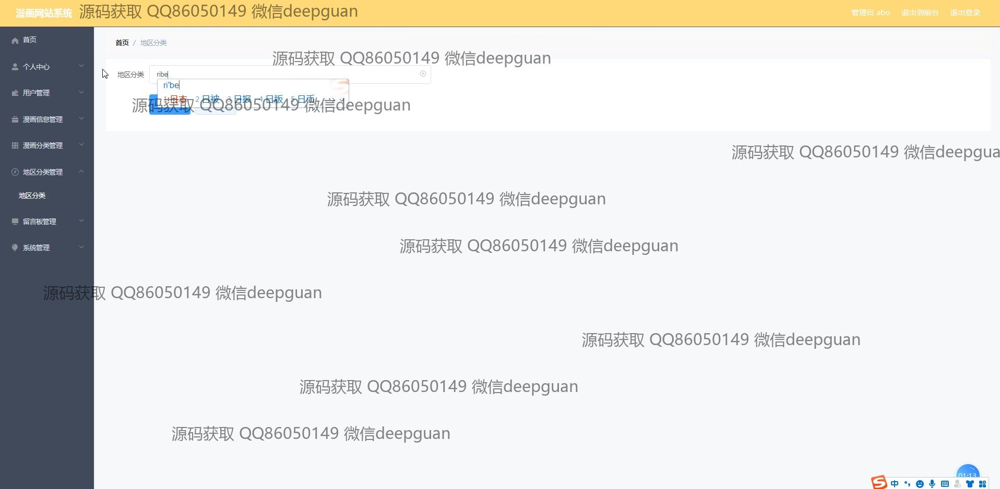
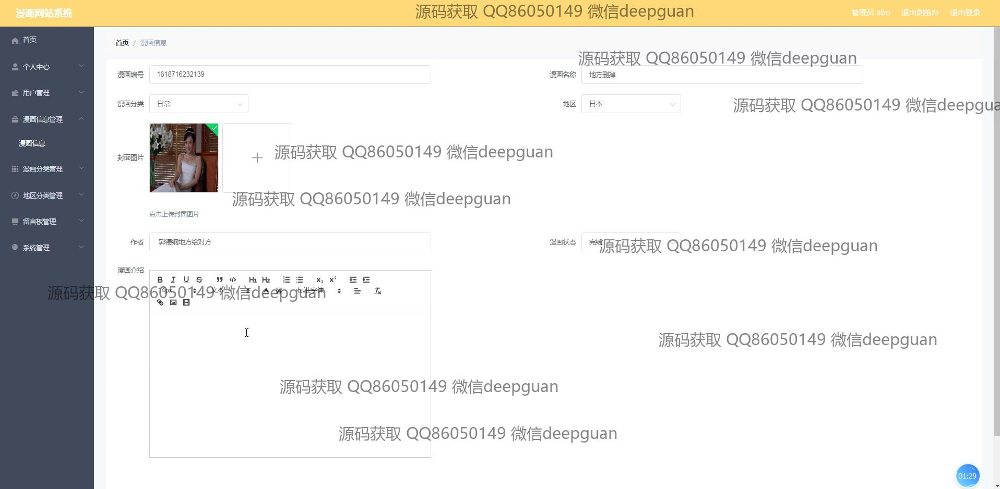
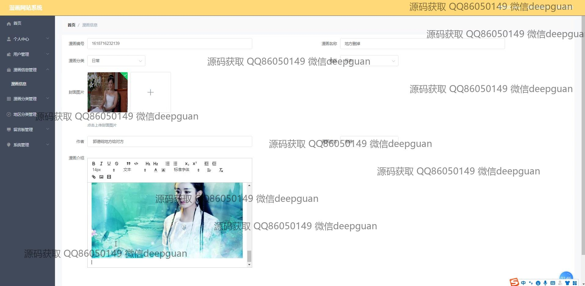
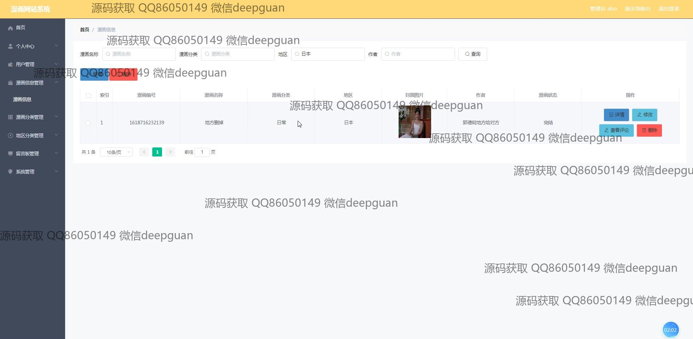
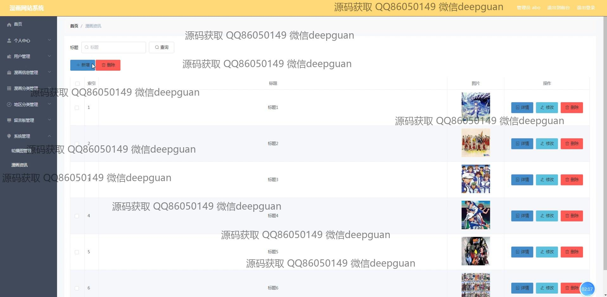
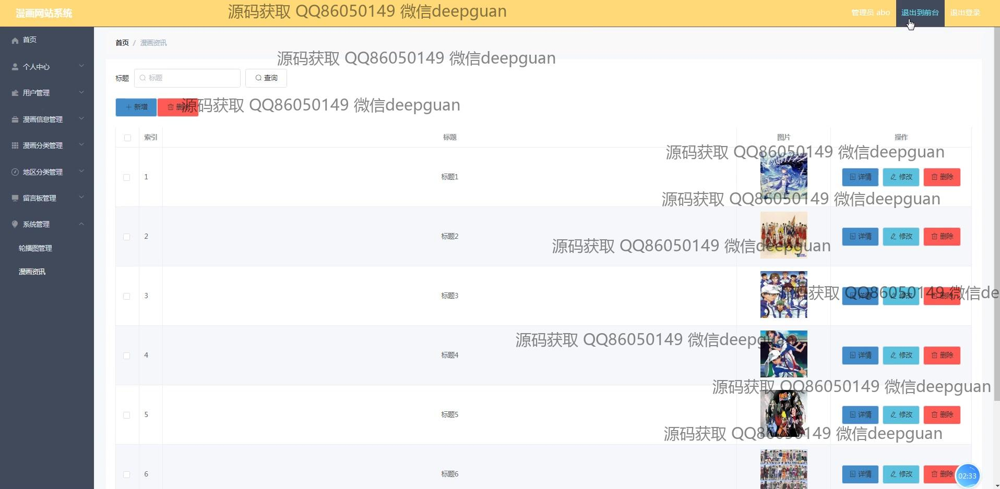
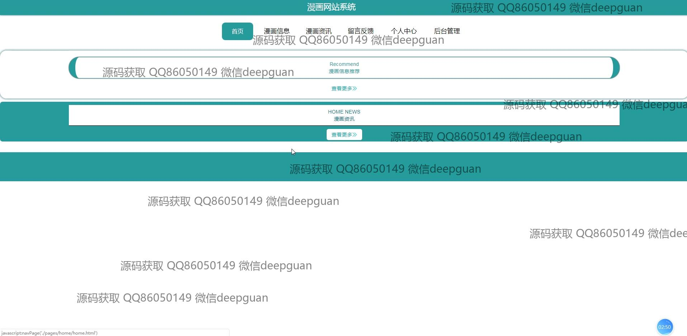
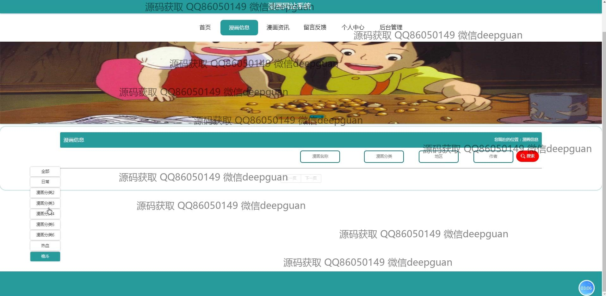
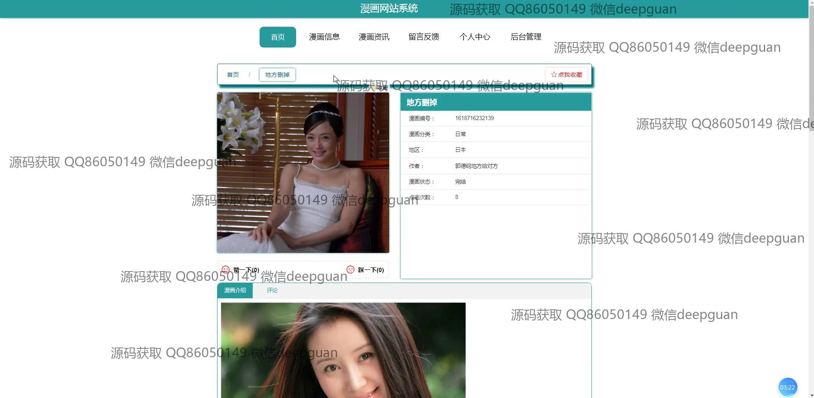

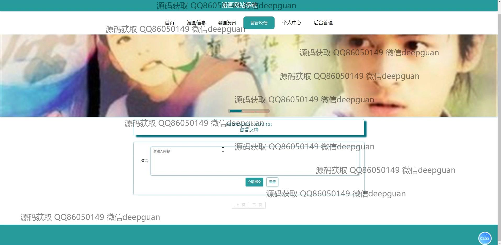
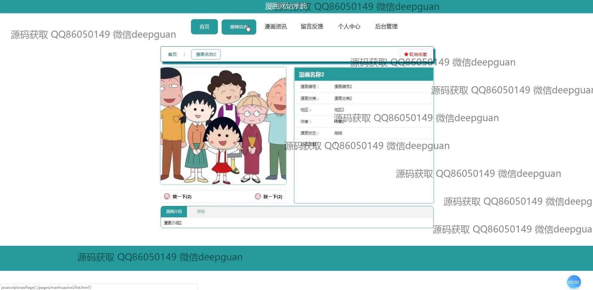
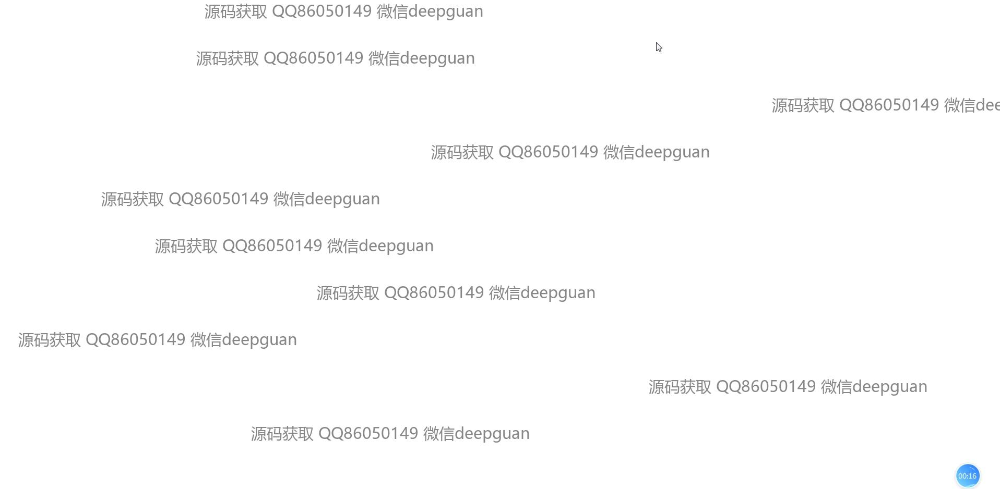
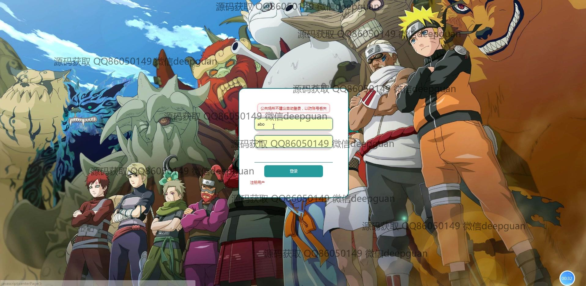

本代码来源于网络,仅供学习参考使用!

